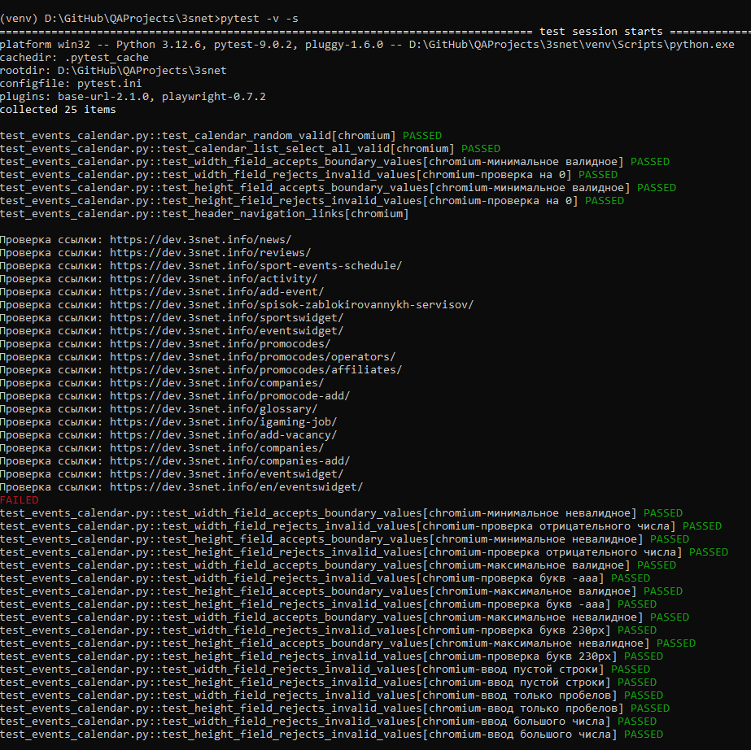
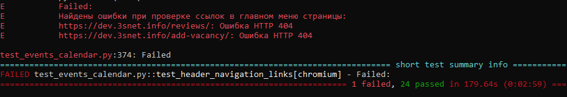

# Автотесты для веб-страницы https://dev.3snet.info/eventswidget/

**Пререквизиты**  
Для запуска тестов на компьютере должны быть предварительно установлены:
- Python 3.12
- git или GitHub Desktop

## Установка библиотек

Для работы с GitHub создайте рабочую папку, например, GitHub.  
В рабочую папку необходимо загрузить файлы с [github](https://github.com/buravlev129).  
Для этого нужно перейти в папку GitHub и выполнить команду:

```shell
   git clone https://github.com/buravlev129/QAProjects.git
```

В папке GitHub появится подпапка `QAProjects` и в ней папка `3snet`.

Перейдите в папку `3snet`, создайте в этой папке виртуальное окружение и активируйте его.

```shell
   cd QAProjects\3snet

   d:\Python312\python.exe -m venv venv
   venv\Scripts\activate
```

Инсталлируйте библиотеки Python, необходимые для работы приложения.

```shell
   pip install -r requirements.txt
```

## Запуск тестов

Запуск тестов выполняется командой:

```shell
   pytest -v -s
```

#### Результат работы тестов


#### Полученные ошибки


